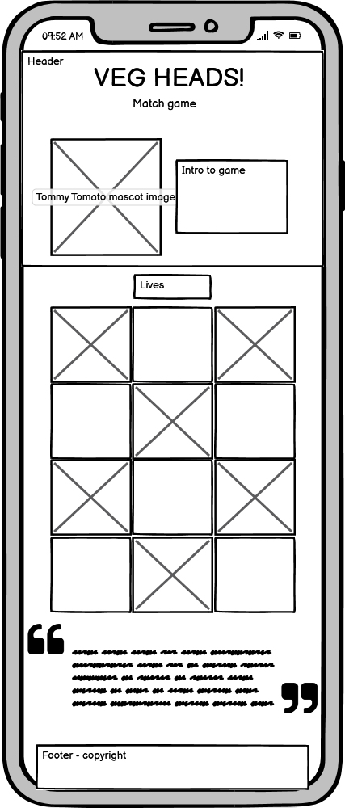
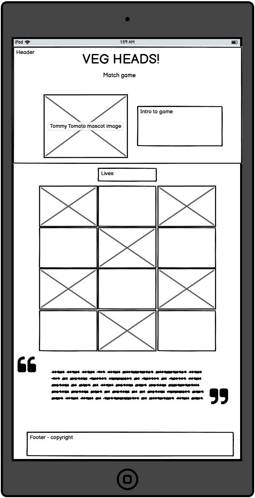
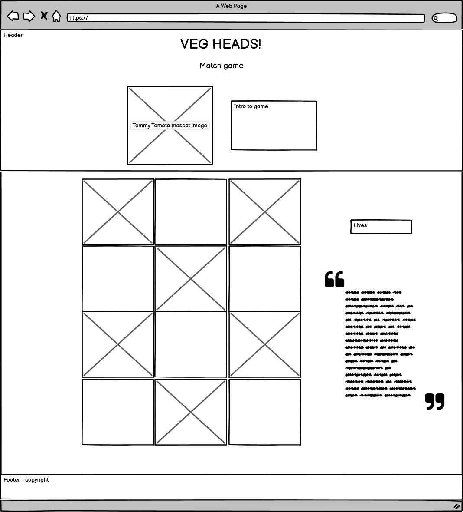
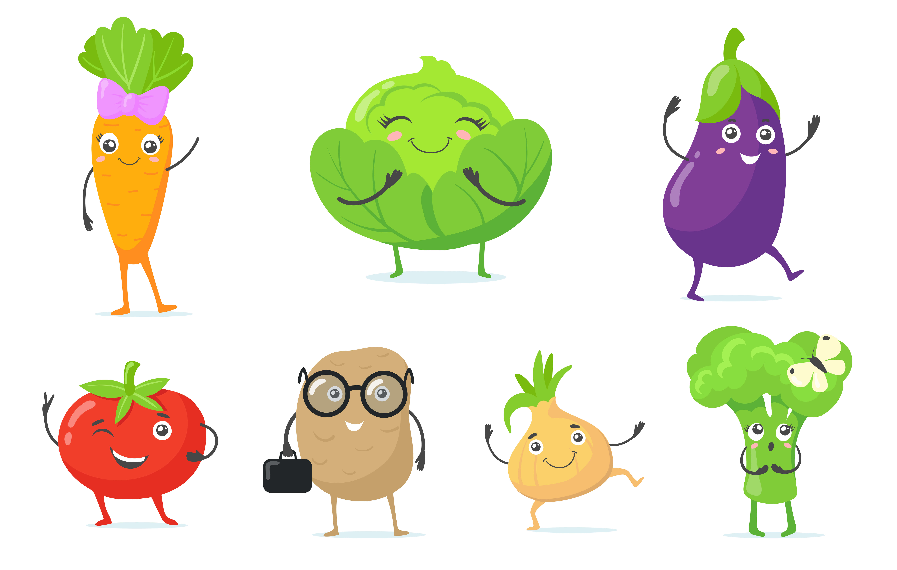

# Milestone project 2
# Tanya Allen
## The Veg Heads! match game

The Veg Heads! Match game is a JavaScript based match 2 game aimed at young children. The aim of the game is to match the vegetable characters to their names. The purpose of the game is to get children to learn about vegetables and healthy food choices through a fun game. It is based on the fictional cartoon group called The Veg Heads! 

### Table of content:
1. [User experience](#1-ux)
* User stories
* Site structure
2. [Design](#2-design)
* Wireframes
* Colours
* Typography
* Imagery
* Design differences
3. [Site limitations](#3-site-limitations)
4. [Features](#4-features)
* Existing
* Future
5. [Technologies used](#5-technologies-used)
6. [Testing](#6-testing)
7. [Deployment](#7-deploymemt)
8. [Credits](#8-credits)

---
### 1 UX
---
#### User Stories

**First time users:**

As a first time user of the game, I want to be able to put my name into the game as the player.

As a first time user of the game, I want to be able to start the game easily.

As a first time user of the game, I want to easily understand the rules and aims of the game. 

As a first time user of the game, I want to be able to play the game bug free. 

As a first time user of the game, I want to be able to play the game on whatever screen size I may be on. 

**Returning users:**

As a returning user of the game, I want to be able to start the game again.

As a returning user of the game, I want the matches to reshuffle so I am not playing the same cards again.

As a returning user of the game, I want my lives to reset when I replay the game. 

**Site owners:**

As an owner of the game site, I want to promote healthy eating for children

As an owner of the game site, I want to teach children about vegetables with simple facts.

#### Site structure

---
### 2 Design
---

#### Wireframes

#### Colours

41AC3C

90E274

465438

Black

White

#### Typography

All fonts used are imported and sourced from Google fonts. 

Gluten

Hachi Maru Pop

Poppins

#### Imagery 

Mascots - The Veg Heads! 

#### Design differences

---
### 3 Site limitations
---
---
### 4 Features
---
#### Future
---
### 5 Technologies used
---
---
### 6 Testing
---
---
### 7 Deploymemt
---
---
### 8 Credits
---

