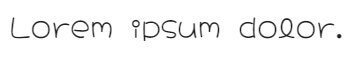

# Milestone project 2
# Tanya Allen
## The Veg Heads! match game

The Veg Heads! Match game is a JavaScript based match 2 game aimed at young children. The aim of the game is to match the vegetable characters to their names. The purpose of the game is to get children to learn about vegetables and healthy food choices through a fun game. It is based on the fictional cartoon group called The Veg Heads! 

You can view the live site [here](https://tanyaelizabeth13.github.io/Milestoneproject2/)

### Table of content:
1. [User experience](#1-ux)
* User stories
* Site structure
2. [Design](#2-design)
* Wireframes
* Colours
* Typography
* Imagery
* Design differences
3. [Site limitations](#3-site-limitations)
4. [Features](#4-features)
* Existing
* Future
5. [Technologies used](#5-technologies-used)
6. [Testing](#6-testing)
7. [Deployment](#7-deploymemt)
8. [Credits](#8-credits)

---
### 1 UX
---
#### User Stories

**First time users:**

As a first time user of the game, I want to be able to put my name into the game as the player.

As a first time user of the game, I want to be able to start the game easily.

As a first time user of the game, I want to easily understand the rules and aims of the game. 

As a first time user of the game, I want to be able to play the game bug free. 

As a first time user of the game, I want to be able to play the game on whatever screen size I may be on. 

**Returning users:**

As a returning user of the game, I want to be able to start the game again.

As a returning user of the game, I want the matches to reshuffle so I am not playing the same cards again.

As a returning user of the game, I want my lives to reset when I replay the game. 

**Site owners:**

As an owner of the game site, I want to promote healthy eating for children

As an owner of the game site, I want to teach children about vegetables with simple facts.

#### Site structure

The site will have a very simple and easy to navigate structure as it is aimed at children.

The header of the page will contain the heading and subheading.

Then there will be a section containing an image of the game mascot and some text with him introducing the user to the concept of the game. 

The game area itself will have a colourful background and the 12 game cards set out over 3 columns and 4 rows. 

On smaller screens, under the game section, will be a text area containing randomly generated facts about fruit, veg, and nutrition. These will be on the right of the game on larger screens.  

The footer of the page will just contain the copyright information. 

---
### 2 Design
---

#### Wireframes

#### Colours

41AC3C (Green Pantone) is used for the main header of the page and the backs of the cards in the game section. It is also used for the button text both on the main page and the custom 404 page. 

90E274 (Light green) is used for the subheading. 

465438 (Rifle green) is used to contrast the brighter greens. It is used for text throughout the project. 

Black is used to make certain point on the page stand out, the 'lives left' text and 'click me' button are important information that users need to see clearly. 

White space is used on the page to give a clean look to the game and make sure the rest of the colour scheme looks more vibrant. 

#### Typography

All fonts used are imported and sourced from Google fonts. 

**Gluten**

Gluten is used for the main heading of the page to create a memorable logo for The Veg Heads! brand. It is also used for the character name cards within the game.

**Hachi Maru Pop**

Hachi Maru Pop is used for the subheading and the ‘lives left’ text. It is a fun font that gives the page a bit of whimsy. 

**Poppins**

Poppins is used for paragraph text throughout the site. It is an easy-to-read font but still ties in with the aesthetic of the game. 

#### Imagery 

**Character - The Veg Heads!**

The Veg Heads! are fictional character based on this free image found on freepik. The image was separated into the individual characters for use in the match game.

**Mascot - Tommy Tomato**

The main mascot is the tomato character, he was chosen as the main one to stand out against the green tones across the page.

**Non character cards**

The matches for the character cards are their names, these where made in gitpod and screen grabbed. 

**Game background**

The game board background is a hand drawn vegetable free background from vecteezy. It is muted enough on colour as to not make the game area hard to see. 

**Favicon**

The site icon is a small tomato sourced from Icons8. 

#### Design differences

Originally the plan was to move the ‘did you know?’ and ‘lives left’ section to the right of the game board on larger screens. After trying this out the idea was dropped as it made the site look messy and asymmetrical, which didn’t go with the minimalistic style of the site. Instead the layout is kept the same as on smaller screens. 

The ‘did you know?’ section was originally intended to generate a random fact every time the game was restarted. The idea was replaced with a ‘click me’ button that generates the facts instead, this increases the interactivity of the site and encourages the users learning. 

---
### 3 Site limitations
---

---
### 4 Features
---

#### Future

---
### 5 Technologies used
---

HTML 5 – The coding language used to structure the site and its content.

CSS 3 – The coding language used to style the site.

JavaScript(ES6) - The coding language used to add interactivity.

Balsamiq – The software used to create wireframes during the design process.

Google Fonts – Open-source font service used to import all custom fonts on the site.

Gitpod – The IDE used to write code and commit to Git.

Git – The software used to manage version control and push to Github.

Github – The repository site used to store the project pushed from Gitpod, also used to deploy the site via Github Pages.

TinyJPG – The website used to compress image sizes to reduce storage used, creating faster loading speeds.

Chrome DevTools – The built-in developer tools used throughout development to check responsivity on all screen sizes.

WAVE – The accessibility evaluation tool used throughout to check all site aspects are fully accessible to users with disabilities.

Lighthouse – The developer tool use to test site performance.

W3 Validator – The validator used to check all pages for syntax errors.

Jigsaw validator – The validator used to check all pages for CSS syntax errors.

JSLint - The analysis tool used to check JS for errors. 

Technsini – The mockup generator site used to create mockup images in README.md.

Microsoft Word - The software used to write README.md, mainly used for spell check purposes.

Microsoft Excel - The software used to make the testing spreadsheet.

---
### 6 Testing
---

---
### 7 Deploymemt
---

This project was initially created in Github using the Code Institute’s full template

Version control was accomplished through the use of Github by pushing to the repository using the following:

Git add was used to stage files before committing.
Git commit -m was used to add commit messages.
Git push was used to push code to the repo.
The project was then deployed using Github Pages by doing the following steps:

Open repository
Click Settings
Click Pages on the left-hand side
In Source select deploy from branch
Select correct branch and root
Click save
Once generated click the link to the live site

---
### 8 Credits
---

